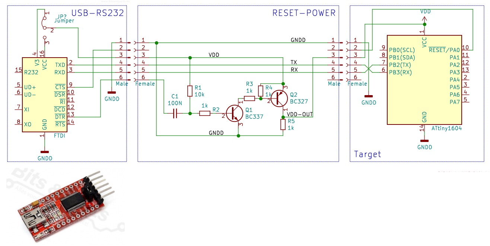

# MegaTinyUtils
   MegaTinyUtils.cpp - Arduino library with **low memory usage** for:
  - serial port writing and reading
  - blocking and non blocking delay functions
  - sleep functionality
  - Bit bang wire (I2C) routine
  - Read Vdd voltage (battery)

  Works with this MegaTiny library:
    https://github.com/SpenceKonde/megaTinyCore

The MegaTinyUtils is only working with the Attiny processors mentioned by the library above.

I made this library for my own projects, but thougth it could be helpfull for others also.
Some parts of the code I found on the internet, but reworked it to fit this library.

Internal functions:
```cpp
// Delay
void Delay(unsigned int delayVal);
bool DelayNonBlock(unsigned int delayVal);
    
 // Sleep
 void SleepInit(RTC_TIME_t RTC_time);
 void GoToSleep(unsigned char times);
    
 // Serial
 void SerialBegin(unsigned char TxPin, long baudrate);
 bool Available(void);
 unsigned char Getchar(void);
 void Putchar(char data);
 void Write(const char *rs232data);
 void WriteNumber(const char *rs232data, long int number, unsigned char base, bool NewLine);

 // Wire BitBang
 void SetupWireBb();
 void StartWireBb();
 void StopWireBb();
 bool WriteWire(unsigned char data);  
 unsigned char ReadWire(bool Ack);
 
 // Read Vdd
 unsigned char ReadVdd(void);
```

## Memory advantage example:

In most projects we want todo some logging via the serial port, but when using the Arduino Serial class,
this will takes a lot of memory (near 2KByte flash!). 
With this library this is less than 1kByte. So even with models with only 2Kb of code flash, logging can be used.

### Arduino Serial class usage;
```cpp
unsigned long PrevMs;

void setup() 
{
  Serial.begin(115200);       // Init the serial port
  delay(300);                 // Blocking start-delay
  Serial.write("Starting\n"); // Serial write
}

void loop() 
{
  static char counter = -8;

  if ( (millis() - PrevMs) > 200 )
  {
    PrevMs = millis();
    Serial.write("counter: ");Serial.println(counter++);  
  }
  if(Serial.available())
  {
    Serial.write(Serial.read());
  }
}
```
Will have 1889 bytes (92%) of flash and 75 bytes (58%) of RAM of a Attiny 202
### MegaTinyUtils Serial class usage;
```cpp
#include <MegaTinyUtils.h>

MegaTinyUtils Utils;

#define TX_PIN PIN_PA2

void setup() 
{
  Utils.SerialBegin(TX_PIN,115200); // Init the serial port
  Utils.Delay(300);                 // Blocking start-delay
  Utils.Write("Starting\n");        // Serial write
}

void loop() 
{
  static char counter = -8;

  if(Utils.DelayNonBlock(200))
  {
    Utils.WriteNumber("counter: ",counter++,10,NEWLINE);  
  }
  if(Utils.Available())
  {
    Utils.Putchar(Utils.Getchar());
  }
}
```
Will have 950 bytes (46%) of flash and 20 bytes (15%) of RAM of a Attiny 202

## Simple methods to handle sleeping of the device

```cpp
#include <MegaTinyUtils.h>

MegaTinyUtils Utils;

#define TX_PIN PIN_PB2
 
void setup() 
{
  Utils.SerialBegin(TX_PIN,115200); // Init the serial port
  Utils.Delay(300);                 // Blocking start-delay
  Utils.Write("Starting\n");        // Serial write
  Utils.SleepInit(RTC_SECONDS_1);   // Base RTC time
}

void loop() 
{
  static int counter = 0;
  Utils.WriteNumber("counter = ",counter++,10,NEWLINE);
  Utils.Delay(5);                   // time the output the chars
  Utils.GoToSleep(3);               // Sleep for 3 times the base time
}
```
With SleepInit the base RTC timing is set. These can have this timing settings:
```cpp
typedef enum RTC_TIME_enum
{
    RTC_MSEC_4     = 0,
    RTC_MSEC_8     = 1,
    RTC_MSEC_16    = 2,
    RTC_MSEC_31    = 3,
    RTC_MSEC_62    = 4,
    RTC_MSEC_125   = 5,
    RTC_MSEC_250   = 6,
    RTC_MSEC_500   = 7,
    RTC_SECONDS_1  = 8,
    RTC_SECONDS_2  = 9,
    RTC_SECONDS_4  = 10,
    RTC_SECONDS_8  = 11,
    RTC_SECONDS_16 = 12,
    RTC_SECONDS_32 = 13
} RTC_TIME_t;
```
The GoToSleep(x) function will sleep for x * Base timing, so in the example this is 3 seconds sleep.

## Bitbang I2C (Wire) routine possible on almost every pin
```cpp
#include <MegaTinyUtils.h>

MegaTinyUtils Utils;

#define TX_PIN PIN_PB2

#define WIRE_ADDRESS (0x1E << 1)

const unsigned char SCL_PIN = PIN_PB0; // Pins to be used for the wire communication
const unsigned char SDA_PIN = PIN_PB1;

uint8_t _buffer[8];

void setup() 
{
  Utils.SerialBegin(TX_PIN,115200); // Init the serial port
  Utils.Delay(300);                 // Blocking start-delay
  Utils.Write("Starting\n");        // Serial write
  Utils.SetupWireBb();              // Init the wire routine
}

void loop() 
{
  WireWrite(0,0x55);
  uint8_t* buffer = WireRead(0x09, 1);
  Utils.WriteNumber("buffer[0]:",buffer[0],10,NEWLINE);
  Utils.Delay(1000);
}

void WireWrite(short address, short data)
{
  Utils.StartWireBb();
  if(Utils.WriteWire(WIRE_ADDRESS) == true)
  {
    Utils.WriteWire(address);
    Utils.WriteWire(data);
    Utils.Write("ACK\n");
  }
  else
  {
    Utils.Write("NACK!\n");
  }
  Utils.StopWireBb();  
}

uint8_t* WireRead(short address, short length) 
{
  byte i;
  Utils.StartWireBb();
  Utils.WriteWire(WIRE_ADDRESS);
  Utils.WriteWire(address);

  Utils.StartWireBb(); // Restart
  Utils.WriteWire(WIRE_ADDRESS + READ_BIT);
  for (i = 0; i < (length - 1) && i < (sizeof(_buffer) - 1); i++) {
    _buffer[i] = Utils.ReadWire(READ_ACK);
  }
  _buffer[i] = Utils.ReadWire(READ_NACK); // Last byte give a NACK
  Utils.StopWireBb();
  return _buffer;
}
```
## Read the Vdd voltage (battery)
```cpp
#include <MegaTinyUtils.h>

MegaTinyUtils Utils;

#define TX_PIN PIN_PB2

void setup() 
{
  Utils.SerialBegin(TX_PIN,115200); // Init the serial port
  Utils.Delay(300);                 // Blocking start-delay
  byte Vdd = Utils.ReadVdd();       // Read the Vdd of the part

  Utils.WriteNumber("Vdd = ",Vdd/10,10,NO_NEWLINE);
  Utils.WriteNumber(".",Vdd%10,10,NO_NEWLINE);  
  Utils.Write(" Volt\n");
}

void loop() 
{
}
```

# Automatic switcher between UPDI programming and serial terminal circuit
 "automatic switcher between UPDI and serial terminal"

This circuit automaticly switches between an UDPI firmware upload and serial monitoring in Arduino
Now uploading and tracing the RS232 output is just working as with other Arduino boards

# Reset circuit when using the bootloader
 "Reset circuit when using the bootlader"

When a bootloader is present in the controller (via Burn Bootloader), you need to reset the controller
before flashing a new sketch in it. We want to have the UPDI programfunctionality on the reset-pin,
and also want to keep all I/O-pins for other purposes than having a software-reset-function.

To reset the controller, it is also possible to remove the supply voltage for a short while.
The DTR pin is going just before programming from VDD to 0 Volt, via C1, Q1 is not conducting
for a short while. In this short time also Q2 is not conducting, so the VDD for the target is removed.
R5 is present to have a low resitant pull down path, so the target is not fed by the TX pin.

With this circuit, all will work as with an ordinary arduino board.
