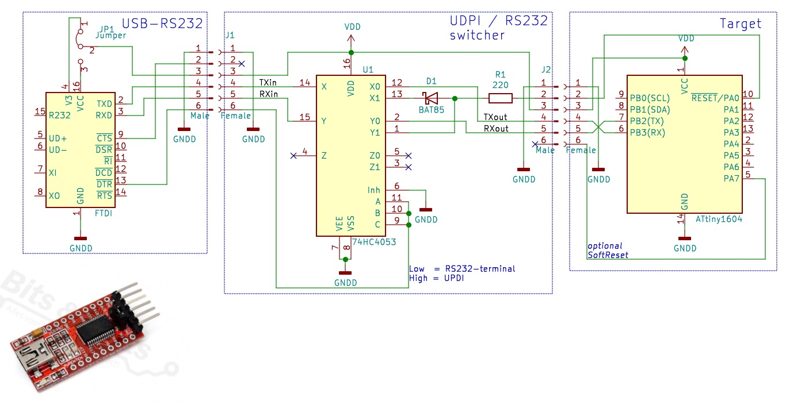

# MegaTinyUtils
   MegaTinyUtils.cpp - Arduino library with **low memory usage** for:
  - serial port writing and reading
  - blocking and non blocking delay functions
  - sleep functionality

  Works with this MegaTiny library:
    https://github.com/SpenceKonde/megaTinyCore

The MegaTinyUtils is only working with the Attiny models mentioned by the library above.

In most projects we want todo some logging via the serial port, but when using the Arduino Serial class,
this will takes a lot of memory (near 2KByte flash!). 
With this library this is less than 1kByte. So even with models with only 2Kb of code flash, the rs232 can be used.

Functions:

    void Delay(unsigned int delayVal);
    bool DelayNonBlock(unsigned int delayVal);
    
    void SleepInit(RTC_TIME_t RTC_time);
    void GoToSleep(unsigned char times);
    
    void SerialBegin(unsigned char TxPin, long baudrate);
    bool Available(void);
    unsigned char Getchar(void);
    void Putchar(char data);
    void Write(const char *rs232data);
    void WriteNumber(const char *rs232data, long int number, unsigned char base, bool NewLine);

## Memory advantage example:

# Arduino Serial class usage;
```cpp
unsigned long PrevMs;

void setup() 
{
  Serial.begin(115200);       // Init the serial port
  delay(300);                 // Blocking start-delay
  Serial.write("Starting\n"); // Serial write
}

void loop() 
{
  static char counter = -8;

  if ( (millis() - PrevMs) > 200 )
  {
    PrevMs = millis();
    Serial.write("counter: ");Serial.println(counter++);  
  }
  if(Serial.available())
  {
    Serial.write(Serial.read());
  }
}
```
Will have 1889 bytes (92%) of flash and 75 bytes (58%) of RAM of a Attiny 202
# MegaTinyUtils Serial class usage;
```cpp
#include <MegaTinyUtils.h>

MegaTinyUtils Utils;

#define TX_PIN PIN_PA2

void setup() 
{
  Utils.SerialBegin(TX_PIN,115200); // Init the serial port
  Utils.Delay(300);                 // Blocking start-delay
  Utils.Write("Starting\n");        // Serial write
}

void loop() 
{
  static char counter = -8;

  if(Utils.DelayNonBlock(200))
  {
    Utils.WriteNumber("counter: ",counter++,10,NEWLINE);  
  }
  if(Utils.Available())
  {
    Utils.Putchar(Utils.Getchar());
  }
}
```
Will have 950 bytes (46%) of flash and 20 bytes (15%) of RAM of a Attiny 202

### automatic switcher between UPDI programming and serial terminal circuit
 "automatic switcher between UPDI and serial terminal"

This circuit automaticly switches between an UDPI firmware upload and serial monitoring in Arduino
Now uploading and tracing the RS232 output is just working as with other Arduino boards

