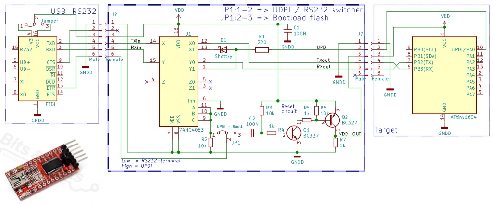

# Circuit for programming / serial tracing an Attiny with UDPI-pin

 "automatic switcher between flashing and the serial terminal"

The header-pinning is based on the very common USB-FTDI-RS232 interface.

With the jumper JP1 two ways of controller flashing can be choosen:

### 1-2 => UPDI programming / serial terminal

In this mode the circuit automaticly switches between an UDPI sketch upload and serial monitoring in Arduino

### 2-3 => Flashing with an internal bootloader / serial terminal
When a bootloader is present in the controller (via Burn Bootloader), you need to reset the controller
before flashing a new sketch in it. We want to keep the UPDI programfunctionality on the updi-pin,
and also want to keep all I/O-pins for other purposes (other than having a software-reset-function).

To reset the controller, it is also possible to remove the supply voltage for a short while.
The DTR pin is going just before programming from VDD to 0 Volt, via C1, Q1 will not conduct
for a short while. In this short time also Q2 is not conducting, so the VDD for the target is removed.
R5 is present to have a low resistant pull-down path, so the parasitic supply by the TX pin is not enough
to keep the part out of reset.

### After the flashing
After the flash action, the serial monitor within Arduino becomes active again (if started via the menu),
so it all works just as with an ordinary arduino board.

