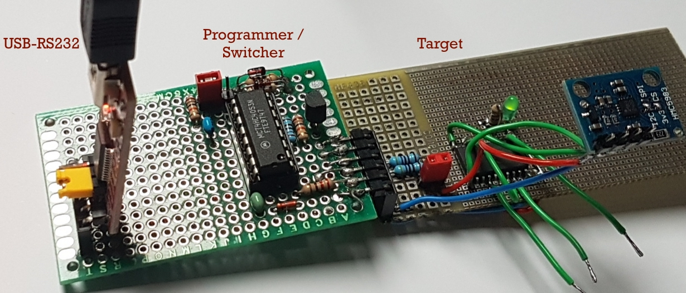
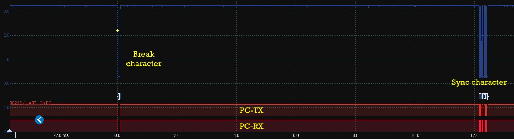
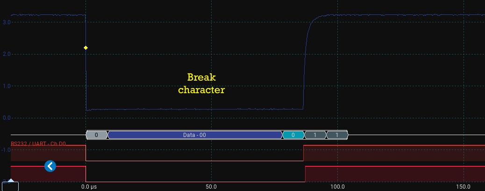
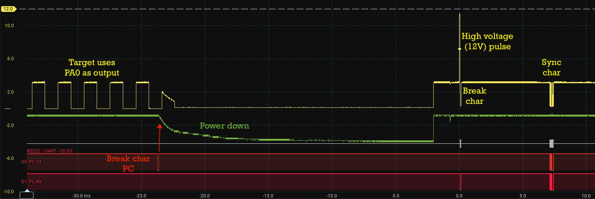
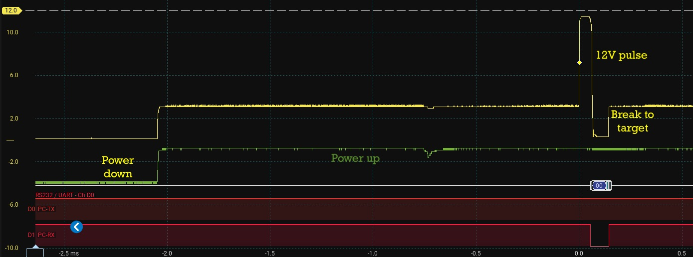
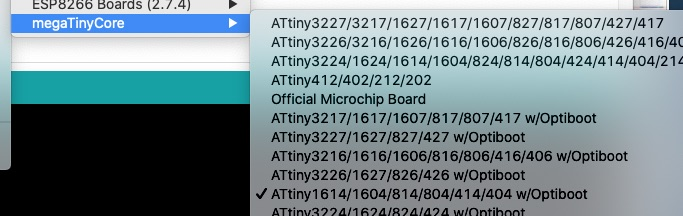
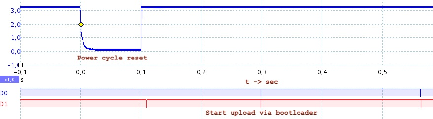
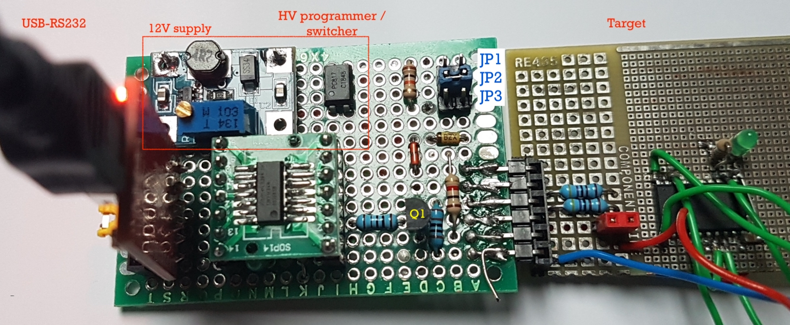

# (High voltage) programming an Attiny via the UDPI-pin, with serial tracing possibility 

New Attiny processors like the Attiny1606 / 414 etc. can be programmed via only one pin (reset pin).
On this page I show some circuits to do this, starting with the most basic one.

To have the same functionality as the standard Arduino's, after programming we like to switch back to the serial port 
so it can be used for RS232 tracing and debugging. With the various programmers I found on the internet this switching to the 
UART for tracing was not possible.

All is based on the pinning of a very standard FTDI-USB-RS232 serial interface

All is working with this MegaTiny board library: https://github.com/SpenceKonde/megaTinyCore

## 1. Basic UPDI only programmer

Pro: very simple design 
Con: No tracing possible via the same serial interface

## 2. UPDI and UART switcher

Pro:
* simple design 
* when Arduino terminal is active, Attiny uart pins are switched to the PC RS232

Con: 
* No reset of the target possible (without programming) 
* When a bootloader is active in the target, this can not be used (no reset) 

## 3. UPDI and UART switcher with reset function

Pro:
* when Arduino terminal is active, Attiny uart pins are switched to the PC RS232

Con:
* No high voltage UPDI possible 

With the jumper JP1 two ways of controller flashing can be choosen:

### 1-2 => UPDI programming / serial terminal

In this mode the circuit automaticly switches between an UDPI sketch upload and serial monitoring in Arduino

### 2-3 => Flashing with an internal bootloader / serial terminal
When a bootloader is present in the controller (via Burn Bootloader), you need to reset the controller
before flashing a new sketch in it. We want to keep the UPDI program functionality on the updi-pin,
and also want to keep all I/O-pins for other purposes (other than having a software-reset-function).

To reset the controller, it is also possible to remove the supply voltage for a short while.
The DTR pin is going just before programming from VDD to 0 Volt, via C3 and filter R3-C2 the switch Z is set
to Z0 for a short while (200ms). During this time Q1 is not conducting, so the VDD for the target is removed.
R5 is present to have a low resistant pull-down path, so the parasitic supply by the TX pin is not enough
to keep the part out of reset.

### After the flashing
After the flash action, the serial monitor within Arduino becomes active again (if started via the menu),
so it all works just as with an ordinary arduino board.

### Build on an experiment-board

## 4. UPDI low and high voltage programmer and UART switcher with reset function

With this circuit an Attiny is doing all the switching of the UART port. With the 3 jumpers the programming mode 
can be set:
* JP1, low voltage UPDI programming and serial tracing
* JP2, high voltage UPDI programming and serial tracing
* JP1,2 no jumper, programming via targets internal bootloader and serial tracing
* JP3 with jumper, the target is not reset (normal operation is without jumper!)

Remark: When it is used with 5Volt, the zenerdiode voltage has to be increased to 5.1Volt.

### Low voltage UPDI
Place jumper JP1, the led is blinking once per 2 seconds 
Select in Arduino the board of the top 3 lines: 
 

press the Arduino upload button. The project is compiled and send via UPDI to the target-processor. 
When the Uart-terminal was active, after programming your trace output can be seen.

Scope traces of the first break and sync character:

 
 

### High voltage UPDI
Place jumper JP2, the led is blinking twice per 2 seconds 
For the further functionality, see the low voltage chapter above.

Scope traces of the first break and sync character:

 
 

The circuit is waiting for the first break character from the PC. This is the trigger to 
give a 12Volt pulse of about 200us. after this pulse a break character is generated and send 
to the target. The rest of the protocol is driven by the python scripts from Arduino. 
By sending a 12Volt pulse, the pin PA0 is forced to the UPDI mode, even it is programmed for reset 
or IO-function.

### Bootloader programming
When no jumpers are placed (the led is blinking three times per 2 seconds), the target is not flashed via UPDI, 
but with the internal bootloader of the target. 
This bootloader first need to be flashed by UPDI to the target:

Choose within the menu the variant with Optiboot:
 

On the programmer place JP1 or JP2, and press burn bootloader on the bottom of the Tools menu.

When a bootloader is present in the target, the sketch can be iuploaded via the Arduino uploadbutton.

Scope trace of the start of the bootload proces (reset the board and begin bootloading): 
 

### Build on an experiment-board

### Sketch for the programmer

The sketch for this programmer can be found here: 
[Programmer sketch](https://github.com/TRudolphi/MegaTinyUtils/tree/main/examples/FlashingSwitcher)

In this sketch also some explanation how it is all working (also the handling of 'realtime' signals with Events 
and the logical block). The sketch can be uploaded by a basic UPDI-programmer with 1 diode / resistor.
